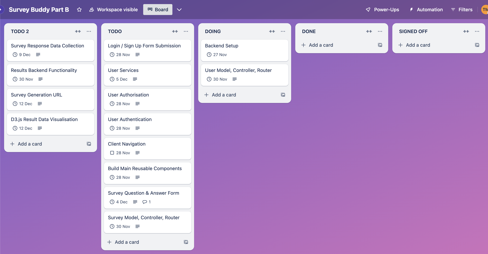
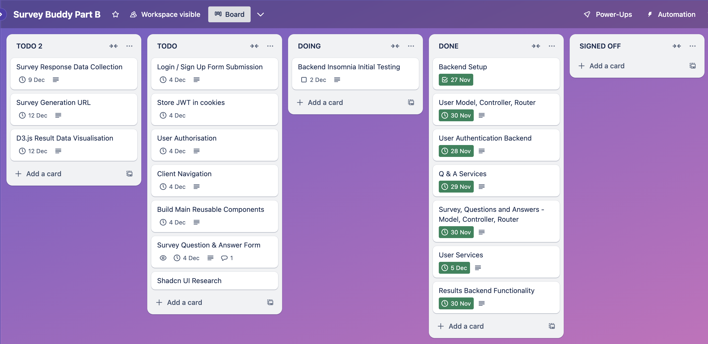
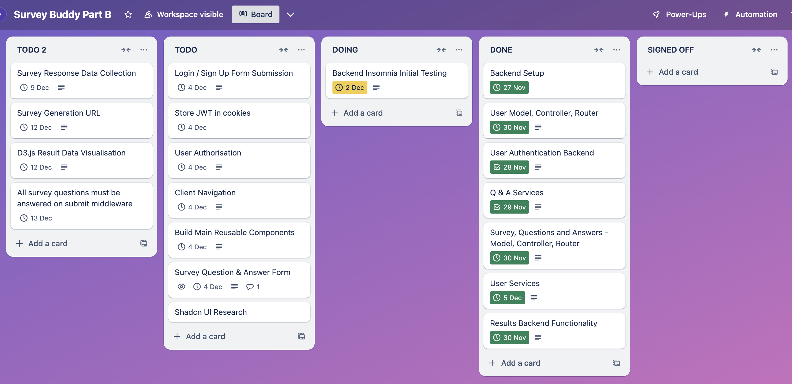
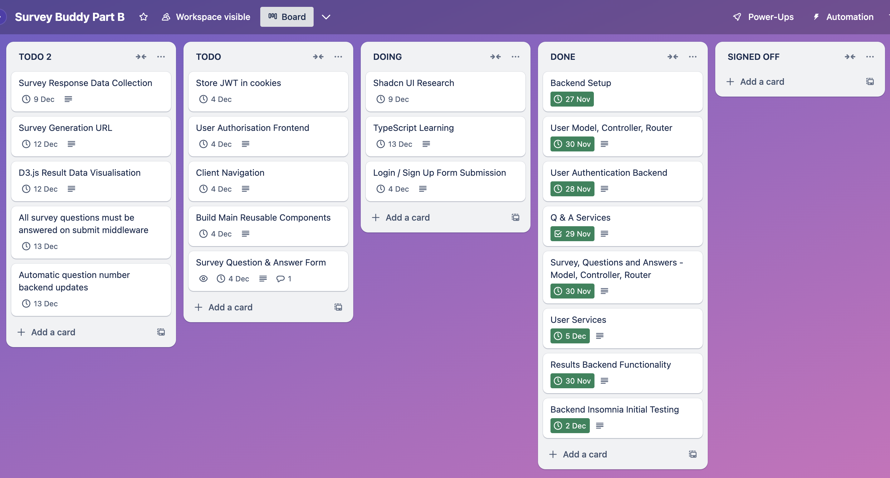
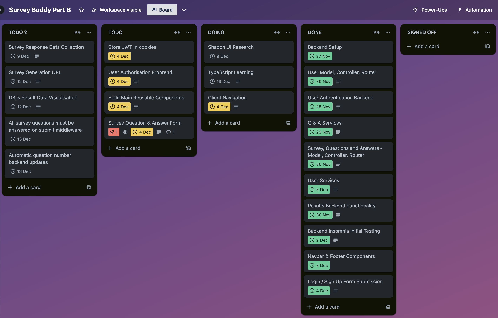
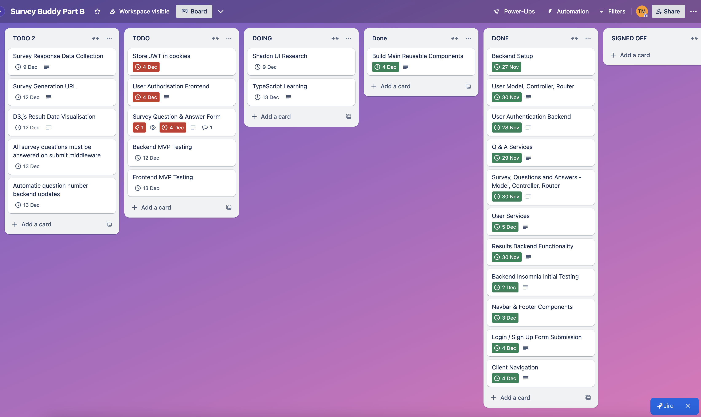

# SurveyBuddy Client

## Part B

#### Tech Stack

- React
  - react forms
  - react router dom
- TypeScript
- D3.js
- Bootstrap
- Chakra UI

### Crucial Decisions

**Schema Design Options**
Here are the options I considered for structuring the database:

**Option 1: Separate Schemas for Surveys, Questions, and Answers**

- Surveys have their own schema with metadata (e.g., title, description).
- Questions are stored in a separate schema linked to surveys via surveyId.
- Answers are stored in another schema, linked to both surveyId and questionId.
  Best for scalability and flexibility.
- Allows easy querying of specific questions or answers.

**Option 2: Combined Schema for Surveys and Questions, Separate Schema for Answers:**

- Surveys and their associated questions are embedded in one schema.
- Answers have a separate schema with references to surveyId and questionId.
- Reduces database reads but makes adding or editing questions more complex.

**Option 3: Single Schema for Surveys, Questions, and Answers:**

- Everything is stored in one schema with nested arrays.
- Simplifies initial setup but leads to large, complex documents.
- Poor scalability and performance for larger surveys.
  Decision to Use Option 1

I chose Option 1 because it’s the most efficient and professional design for a real-world app. It separates concerns, making it easier to add features or scale the app later. It also demonstrates my ability to design a well-structured, normalised, and scalable database, which is an important skill in full-stack development. This approach is ideal for a school project where I want to showcase my expertise.

### Trello Board Tracking

#### 25th of November - Let The Build Begin!

- Set up the backend skeleton and connected to MongoDB Atlas.
- Created User Schema, Model, and Signup Controller route.
- Implemented password services (hashing and comparison) and user services (check for existing username/email).
- Developed JWT functions for token generation.
- Tested signup functionality using Insomnia.

#### 27th of November

- Built middleware to validate question and answer inputs.
- Created newQuestion endpoint to add new questions to the database.
- Implemented editQuestion endpoint to update specific fields of an existing question.
- Fixed issue where updates were not saving correctly by adjusting findByIdAndUpdate logic.
- Developed deleteQuestion endpoint to remove a question by ID.
- Enhanced error handling with detailed response messages and server-side logging.
- Tested all question-related endpoints for proper functionality.

#### 28th of November

- Implemented middleware to check if a question belongs to a specific survey (questionBelongsToSurvey).
- Updated survey and question schemas to better handle relationships between surveys and questions.
- Added logic to handle the question format validation within the editQuestion route.
- - Used findByIdAndUpdate to update questions with new data (question format, question text, and answer).
- Added validation checks to ensure data integrity when editing questions (checking for missing fields).
- Implemented checks to verify if a question exists before updating or deleting it.
- Debugged and tested the functionality of updating and deleting questions with the correct logic in place.
- Moved all MVP backend cards to the **DONE** column, will revisit in a few days to optimise code and introduce further middleware.

Due to underestimating how long building the backend MVP would take, the frontend cards due today were assigned a new due date of the 4th of Decemeber. After finishing the backend the next sprint will be to get these cards complete. Since I am behind schedule and working hard on getting the backend complete, the time extension is in no way an issue.

#### 1st of December

**Debugged and Fixed Middleware Issues:**

- Troubleshooted issues with the isCreator middleware.
- Ensured proper user validation for both Survey and Question models.
- Corrected the handling of user ownership checks for different models.

**Refactored isCreator Middleware:**

- Improved the isCreator middleware to handle dynamic model and field checking.
- Enhanced logic for checking the creator of a Question through the associated Survey.

**Tested and Ensured Proper Model Checks:**

- Made sure the middleware works correctly for both Survey and Question routes.
- Verified that only the creator (based on userId) can perform specific actions.

#### 2nd of December

### Frontend:

- **Investigated Chakra UI**:

  - Researched Chakra UI as a UI component library.
  - Resolved errors related to ChakraProvider by including the `value` prop.

- **Explored ShadCN**:

  - Researched ShadCN for UI component options.
  - Decided to use ShadCN to build a responsive navbar.

- **Navbar Development**:

  - Created a simple, responsive navbar using ShadCN components (`Box`, `Flex`, `Text`, and `Button`).
  - Implemented a mobile-friendly design with a toggleable menu using state.

- **Fixed Client Errors**:
  - Addressed and resolved various client-side errors, ensuring smoother functionality.

### Backend:

- **Survey and Answer Routes**:

  - Developed backend routes for managing surveys and answers.
  - Created routes for adding answers to specific survey questions and handling answer data.

- **Testing with Insomnia**:

  - Tested the survey API endpoints using Insomnia to ensure correct functionality.
  - Checked responses, ensured data validation, and confirmed that routes worked as expected.

- **Middleware Setup**:

  - Applied dynamic middleware to validate IDs in request parameters (e.g., `surveyId`, `questionId`, `answerId`, `userId`).

- **Database Integration**:
  - Integrated MongoDB (or another database) to store survey data, answers, and user-related information.

#### 2nd of December

### Frontend:

- **Investigated Chakra UI**:

  - Researched Chakra UI as a UI component library.
  - Resolved errors related to ChakraProvider by including the `value` prop.

- **Explored ShadCN**:

  - Researched ShadCN for UI component options.
  - Decided to use ShadCN to build a responsive navbar.

- **Navbar Development**:

  - Created a simple, responsive navbar using ShadCN components (`Box`, `Flex`, `Text`, and `Button`).
  - Implemented a mobile-friendly design with a toggleable menu using state.

- **Fixed Client Errors**:
  - Addressed and resolved various client-side errors, ensuring smoother functionality.

### Backend:

- **Survey and Answer Routes**:

  - Developed backend routes for managing surveys and answers.
  - Created routes for adding answers to specific survey questions and handling answer data.

- **Testing with Insomnia**:

  - Tested the survey API endpoints using Insomnia to ensure correct functionality.
  - Checked responses, ensured data validation, and confirmed that routes worked as expected.

- **Middleware Setup**:

  - Applied dynamic middleware to validate IDs in request parameters (e.g., `surveyId`, `questionId`, `answerId`, `userId`).

- **Database Integration**:
  - Integrated MongoDB (or another database) to store survey data, answers, and user-related information.

## 

#### 3rd of December

- Created a basic landing page for your app.
- Developed signup and login components using ShadCN.
- Researched ShadCN to understand its capabilities and integrate it effectively.
- Troubleshot and implemented a responsive footer that stays at the bottom of the page and spans the full width of the screen.
- Resolved layout issues with images, ensuring proper scaling (e.g., setting an image to 70% size without pushing the footer).
- Ensured consistent margins for grid components, maintaining balanced layouts.
- Refined your app's router setup, making navigation seamless for future development.

#### 5th of December

- Completed the setup for routing and navigation across all pages.
- Implemented links to the respective pages (e.g., Home, Surveys, Analytics, Targeted, etc.) using React Router.
- Ensured that all pages are connected properly, and links are functioning as expected on the client-side.
- Verified that navigation items in the header (e.g., Survey, About, Community) lead to the correct pages.
- Created a responsive navigation menu with ShadCN and lucide-react icons for improved user interaction.

