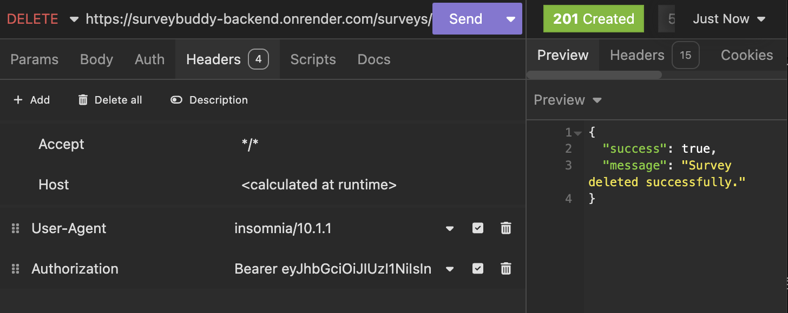

# SurveyBuddy Client

## Part B

You can find the deployed SurveyBuddy App **[here](https://surveybuddy.tech/)**.

---

### **CMP1003-1.1: Demonstration of DRY (Don’t Repeat Yourself) Principles**

View

 

This project demonstrates excellent adherence to DRY principles by avoiding unnecessary repetition and ensuring all functionality is centralised and reusable. The following approaches were implemented:

---

#### **1. Reusable Components**

- Modular and reusable UI components, such as buttons, forms, cards, badges, and navigation menus, were created.
- **ShadCN** components were used to build a consistent set of components, allowing for easy reuse across the application with configurable props.

#### **2. Centralised Utility Functions**

- I applied DRY principles by creating a shared functions file for API requests, ensuring consistent and reusable logic across the application. This centralisation reduced redundancy, improved maintainability, and promoted a single source of truth for common operations like data fetching and token handling.

#### **3. Context and Global State Management**

- Global state was managed using **React Context**, reducing the need for repeated state logic and simplifying component communication. This was applied to manage features such as user authentication and user data.

#### **4. Backend Code Reusability**

- Middleware functions were created for common tasks such as authentication, creator validation, and question formatting, ensuring they could be reused across multiple routes.
- Modular MongoDB models, such as `Survey` and `User`, served as single sources of truth for database schema definitions.

#### **5. Form Management**

- **React Hook Form** was used to handle form state and validation in a consistent and reusable manner, improving code maintainability and reducing duplication.
- Forms components were used for multiple purposes for creating a new survey and auto populated for editing survey data.

---

By following these approaches, the project ensures that every piece of functionality is centralised, unambiguous, and has a single authoritative representation. This makes the codebase easier to maintain, scalable, and efficient.

### CMP1003-1.2: Appropriate use of libraries used in the app

View

 

## Frontend

- **[Vite](https://vitejs.dev/):** A fast build tool that improves development with instant updates and great performance.
- **[React](https://reactjs.org/):** A JavaScript library for creating user interfaces in a reusable, component-based way.
- **[ShadCN](https://shadcn.dev/):** A utility library combining Tailwind CSS and Radix UI components for accessible, responsive design.
- **[Tailwind CSS](https://tailwindcss.com/):** A CSS framework for designing modern, responsive layouts using utility classes.

## Backend

- **[Express](https://expressjs.com/):** A lightweight framework for building server-side APIs and applications in Node.js.
- **[Node.js](https://nodejs.org/):** A JavaScript runtime environment for running server-side code.

## Database

- **[MongoDB](https://www.mongodb.com/):** A NoSQL database for storing flexible, JSON-like documents that scale easily.

## Additional Libraries

### UI & Animations

- **[Radix UI](https://www.radix-ui.com/):** Provides accessible, customisable, and unstyled components for building design systems.
- **[Framer Motion](https://www.framer.com/motion/):** Adds smooth, declarative animations to your React app.
- **[React Hook Form](https://react-hook-form.com/):** A lightweight library for managing forms and validations efficiently.
- **[Zod](https://zod.dev/):** A schema validation library to ensure data consistency.
- **[Lottie React](https://github.com/LottieFiles/lottie-react):** Displays vector animations for enhancing visual appeal.

### Charts & Visualization

- **[Recharts](https://recharts.org/):** A library for creating interactive data visualisations in React.

### HTTP & State Management

- **[Axios](https://axios-http.com/):** A promise-based HTTP client for handling API requests.
- **[JS-Cookie](https://github.com/js-cookie/js-cookie):** A simple way to manage browser cookies.
- **[jwt-decode](https://github.com/auth0/jwt-decode):** Decodes JSON Web Tokens (JWT) for authentication.

---

## Testing

- **[Vitest](https://vitest.dev/):** A fast test runner and assertion library built for Vite and modern web apps.
- **[Testing Library](https://testing-library.com/docs/react-testing-library/intro):** Provides utilities for testing React components by simulating user interactions.
- **[JSDOM](https://github.com/jsdom/jsdom):** Emulates a browser environment in Node.js for testing purposes.
- **[Mock Service Worker (MSW)](https://mswjs.io/):** Intercepts network requests for testing APIs without relying on real servers.
- **[Axios Mock Adapter](https://github.com/ctimmerm/axios-mock-adapter):** Mocks Axios requests and responses for reliable API testing.

---

## Development Tools

- **[TypeScript](https://www.typescriptlang.org/):** A strongly typed superset of JavaScript for catching bugs early and improving code quality.
- **[ESLint](https://eslint.org/):** A tool for identifying and fixing coding issues to ensure consistent code quality.
- **[Prettier](https://prettier.io/):** Automatically formats code for better readability and consistency.

## Build & Deployment

- **[Vite](https://vitejs.dev/):** Also handles production builds with optimized performance.
- **[Tailwind CSS](https://tailwindcss.com/):** Uses PostCSS to generate efficient styles for production.

### **CMP1002-2.1: Demonstration of Code Flow Control**

View

 

The application effectively demonstrates code flow control by utilising conditional logic, loops, error handling, and asynchronous operations to manage how the application processes data and handles various scenarios. The following examples highlight how this is achieved:

---

#### **1. Conditional Logic**

- Conditional statements are used to handle various application states and behaviours. Examples include:
  - Checking if required fields are provided before conditionally rendering forms.
  - Verifying user authentication and authorisation using middleware before allowing access to protected routes.
  - Dynamically rendering UI elements based on if a user is signed in or data availability.

#### **2. Loops and Iteration**

- Iterative logic is applied in key areas of the application, such as:
  - Mapping over datasets to dynamically generate UI elements (e.g., survey lists).
  - Iterating over responses from the database to format or filter data for specific question result charts and graphs.

#### **3. Error Handling**

- Try-catch blocks are implemented to manage errors in both synchronous and asynchronous operations. For example:
  - API calls include error handling to provide meaningful feedback to the user in case of failures.
  - Validation errors in forms and database operations are caught and appropriately handled to prevent application crashes.

#### **4. Asynchronous Operations**

- Asynchronous code is used extensively to handle operations like:
  - Fetching data from external APIs or the database using `async/await`.
  - Updating the UI in real-time after receiving responses from the server.
  - Managing race conditions by awaiting specific operations before proceeding (e.g., user authentication before accessing homepage data).

#### **5. Middleware for Controlled Flow**

- Middleware is used in the backend to control the flow of requests:
  - Authenticating users and rejecting unauthorised access.
  - Validating request data and blocking invalid inputs before they reach the main logic.
  - Formatting data conditionally such as question format.

#### **6. Frontend State Control**

- React's state management is used to handle UI and data flow efficiently:
  - Loading states are implemented to control what is displayed while awaiting API responses (loading for example).
  - Tab state it updated and data is passed to different schemas conditionally dependent on value of said state.
  - Context is used to manage global states, such as user data, ensuring a consistent flow of information across components.

---

By implementing these strategies, the application ensures controlled, predictable, and efficient execution of code, meeting the requirements for demonstrating code flow control.

### **CMP1002-2.2: Application of Object-Oriented Principles/Patterns**

View

 

The application demonstrates superior use of object-oriented principles and patterns to enhance maintainability, scalability, and serviceability. The following object-oriented principles and patterns are applied throughout the app:

---

#### **1. Encapsulation**

- **Database Models**: Encapsulation is applied through modular MongoDB models (`Survey`, `User`, etc.), where each model defines its own properties and methods, ensuring a clear separation of concerns.
- **Controllers**: Backend logic is encapsulated into controller functions that handle specific responsibilities, such as creating, updating, or deleting resources. This structure prevents duplication and keeps related logic together.

#### **2. Inheritance**

- Shared middleware functions (e.g., for authentication and validation) act as a base layer for route-specific middleware, following an inheritance-like structure. For example:
  - `isCreator` middleware extends basic authentication checks by adding role-specific logic.

#### **3. Polymorphism**

- Polymorphism is demonstrated in:
  - **Frontend Reusability**: Reusable React components (e.g., buttons, forms) adapt to different contexts using props or conditional statements, allowing a single component to handle multiple use cases.

#### **4. Abstraction**

- **Utilities and Services**: Common logic, such as validation, API requests, and types, are abstracted into utility functions and shared services. This abstraction hides implementation details while exposing clear, reusable interfaces.
- **Routes**: Backend routing uses layered abstraction:
  - Routes define the entry points.
  - Middleware handles common processing (e.g., validation, formatting, authentication).
  - Controllers handle the core business logic.

#### **5. Modular Design**

- The project is structured into self-contained modules:
  - Models, controllers, and routes are separated to ensure a clear and maintainable architecture.
  - Shared components, utilities, and constants are stored in dedicated folders to promote reuse and consistency.

#### **6. Single Responsibility Principle (SRP)**

- Each class, function, and module is designed to perform a single responsibility:
  - Controllers focus solely on business logic.
  - Middleware handles authentication, validation, formatting, and error checking.
  - React components handle specific UI elements without coupling too much logic where possible.

#### **7. Dependency Injection**

- The app follows dependency injection principles:
  - Middleware injects required data (e.g., `request.user`) into controllers.
  - Components receive data and actions as props or via params, promoting testability and flexibility.

#### **8. Positive Impact on Maintainability and Serviceability**

- The use of these object-oriented principles has the following benefits:
  - **Maintainability**: Clear separation of concerns ensures that changes can be made in one area without affecting others.
  - **Scalability**: Modular design and reusable patterns make it easy to add new features or expand existing functionality.
  - **Serviceability**: Abstraction and encapsulation reduce code complexity, making debugging and updates straightforward.

---

By incorporating these object-oriented principles and patterns throughout the application, the project ensures high code quality, maintainability, and scalability while adhering to professional development standards.

### **CMP1002-4.1: Employ and Utilise Proper Source Control Methodology**

View

 

This project demonstrates excellent use of source control methodology, with consistent and thorough application of version control practices throughout its development. As a solo project, all source control activities were performed by a single developer, ensuring clear documentation and management of the entire codebase.

---

#### **1. Frequent and Consistent Commits**

- Over 150 commits were made across the frontend and backend repositories, reflecting consistent and focused development efforts.
- Commits were made on nearly every day of the project, with only two days without commits, highlighting sustained progress and commitment.
- Each commit represented a specific task, update, fix or feature, ensuring clarity and traceability.

#### **2. Structured Branching and Merging**

- Feature branches were created for new functionality, and all changes were merged into the main branch upon completion and testing.
- A clear branching strategy was used to separate work on features, fixes, and testing ensuring the stability of the main branch.
- Merges were performed regularly to keep the main branch up to date and to prevent conflicts.

#### **3. Use of Pull Requests**

- Pull requests were created for all significant updates, providing a structured way to review and test changes before merging into the main branch.
- This practice ensured code quality and maintained the integrity of the project even as a solo developer.

#### **4. Meaningful Commit Messages**

- Commit messages were detailed, describing the purpose of each change. This ensured a clear and understandable Git history.
  - Example: "Implement user authentication with JWT," "Fix responsive design for survey dashboard," "Add validation to survey creation form."

#### **5. Frontend and Backend Source Control**

- Commits were distributed between the frontend and backend, with both repositories showing consistent activity and progress.
- Version control practices were applied uniformly across both sections, ensuring the same level of organisation and quality.

#### **6. Source Control for Collaboration and Recovery**

- Although this was a solo project, best practices for collaborative workflows were applied:
  - Clear commit messages and pull requests provided documentation suitable for team environments.
  - Git history served as a reliable backup, enabling recovery or rollbacks if needed.

---

#### **Impact on Project Development**

- **Consistency**: Frequent commits and a disciplined workflow ensured steady progress throughout the project.
- **Traceability**: The Git history provided a clear record of changes, making it easy to track progress and debug issues.
- **Maintainability**: Structured use of branches, pull requests, and clear commit messages resulted in a clean and maintainable codebase.

This project demonstrates superior source control methodology, meeting the requirements for CMP1002-4.1 through consistent commits, structured workflows, and detailed documentation of development activities.

### **CMP1003-6.2: Employ and Utilise Project Management Methodology**

View

 

This project demonstrates the effective use of project management methodology by implementing a structured and organised workflow using a Trello board. Clear standards for planning and task management were defined and consistently adhered to throughout the development process.

---

#### **1. Use of Trello Board**

- A Trello board was employed to manage the project, ensuring tasks were clearly defined, prioritised, and tracked.
- Cards represented individual tasks, features, or requirements, with detailed descriptions, labels, and covers for easy identification.

#### **2. Task Labels for Difficulty**

- Tasks were labelled based on their difficulty to aid prioritisation and planning:
  - **Green**: Easy tasks.
  - **Yellow**: Medium difficulty tasks.
  - **Red**: Hard tasks.

#### **3. Card Covers for Build Areas**

- Card covers were colour-coded to section tasks into specific areas of the build:
  - **Green**: Testing.
  - **Purple**: Frontend development.
  - **Pink**: User interface (UI) design.
  - **Light Blue**: Backend development.
  - **Blue**: Other tasks.

#### **4. Columns for Workflow Management**

- The board included columns for:
  - **Doing**: Tasks actively being worked on.
  - **Done**: Completed tasks.
  - **Signed Off**: Tasks reviewed and approved.
- These columns helped visualise the project's progress and ensured tasks moved through a structured workflow.

#### **5. Sprint Organisation**

- Tasks were grouped into sprints, providing a clear timeline for achieving specific goals within defined timeframes.
- This approach ensured the project remained on track and progress could be easily monitored.

---

#### **Impact on Project Development**

- **Organisation**: The Trello board provided a clear and structured overview of the project, making it easy to track progress and manage tasks effectively.
- **Clarity**: Labels and colour-coded covers enhanced the visibility of task priorities and build areas.
- **Accountability**: The workflow columns ensured tasks were completed and signed off systematically, reducing the risk of missed requirements.
- **Efficiency**: Sprint planning allowed for focused and manageable work cycles, leading to consistent and measurable progress.

This project showcases the successful use of a project management methodology with well-defined standards, ensuring clarity, organisation, and adherence to planning throughout the development process.

### **CMP1002-3.1: App Functionality**

View

 

The application demonstrates outstanding functionality, meeting and exceeding client and user needs by delivering an intuitive and feature-rich experience. The following features highlight how the app achieves this:

---

#### **1. Easy Navigation**

- The app is designed with a clean and straightforward user interface, allowing users to easily access all functionalities without confusion.
  
- A tab-based single-page system ensures a seamless and efficient workflow for multi format question creation and management.
  

#### **2. Survey Creation**

- Users can create new surveys with minimal effort, supported by a simple and intuitive process.
- The use of a single-page questions tab system allows users to:
  - Add questions directly to a survey without navigating away from the current page.
  - View and manage all survey details in one place.

#### **3. Visual Data Representation**

- The app includes visual tools for analysing survey responses:

  - **Pie Chart**: Displays results for multiple-choice questions, offering a clear and engaging way to visualise response distribution.

  

  - **Bar Graph**: Represents responses from range slider questions (e.g., 0-10 ratings), enabling users to easily identify trends.

  

  - **List View**: Displays written responses in a clear, readable format, ensuring all data types are accessible.

  

#### **4. Editable and Deletable Surveys**

- Surveys can be edited and updated, allowing users to adjust questions or settings after creation.
  

- Surveys are also deletable, providing flexibility in managing survey data.
  

#### **5. Copy Link Functionality**

- The app includes auto-click link icons to copy survey URLs directly, making it effortless for users to share surveys with participants.
  

---

#### **Impact on User Experience**

- **Ease of Use**: Intuitive design ensures users can navigate and use the app without requiring training or documentation.
- **Efficiency**: Single-page tabs streamline question creation and management, reducing the time and effort needed for these tasks.
- **Data Analysis**: Built-in visualisations and response lists exceed expectations by offering powerful insights into survey results in a user-friendly manner.
- **Flexibility**: The ability to edit, delete, and easily share surveys ensures the app adapts to the dynamic needs of its users.d

This application not only meets client and user expectations but also exceeds them by providing a feature-rich, intuitive, and visually appealing solution for survey creation and analysis.

### **CMP1002-4.2: Deployment**

View

 

The application demonstrates a successful and professional deployment process, meeting all requirements for CMP1002-4.2 by using cloud hosting services, environment variables, a custom domain name, and consistent database types across environments.

---

#### **1. Cloud Hosting Services**

- The frontend was successfully deployed on **Netlify**, ensuring fast, reliable, and globally distributed delivery of the application.
  

- The backend was deployed on **Render**, providing a scalable and secure platform for handling API requests and server-side functionality.
  

#### **2. Custom Domain Name**

- A custom domain name, **surveybuddy.tech**, was configured and integrated with the deployment to provide a professional and easily recognisable web address.

#### **3. Consistent Database Usage**

- The application uses the same **MongoDB** database for both production and testing environments, ensuring consistency and reliability in data handling.
- A separate test database was used for local development and testing, maintaining a clean separation from production data.

#### **4. Use of Environment Variables**

- **Environment variables** were utilised to securely manage sensitive information such as:
  - Database connection strings.
  - API keys.
    
- This approach ensures the secure and seamless management of configuration settings across different environments.

---

#### **Impact on Project Development**

- **Reliability**: Cloud hosting on Netlify and Render ensures the app is highly available and performant for end users.
- **Professionalism**: The custom domain name enhances the app’s credibility and branding.
- **Consistency**: Using the same database type across production, testing, and development environments minimises discrepancies and ensures predictable behaviour.
- **Security**: Environment variables protect sensitive information and make the deployment process more secure and adaptable.

The successful deployment of the application with a custom domain and consistent production practices demonstrates a high level of technical proficiency and professionalism.

### **CMP1002-3.2: User Interface**

View

 

The application features a highly intuitive user interface, ensuring smooth and effortless user flow. The following elements demonstrate how the interface supports and enhances the user experience:

---

#### **1. Navigation Bar**

- A clearly designed navigation bar provides users with easy access to all key areas of the application.
- The navigation options are straightforward and labelled appropriately, ensuring users can move between sections without confusion.
  

#### **2. Back Buttons**

- Back buttons are consistently placed and function as expected, enabling users to return to the previous step or page with ease.
- This reduces cognitive load and allows users to navigate the app fluidly.

#### **3. Seamless User Flow**

- The interface is structured logically, guiding users through tasks like creating surveys, adding questions, and reviewing responses without unnecessary steps.
- A consistent design language ensures users intuitively understand how to interact with the app, even on their first use.

#### **4. Simplicity and Clarity**

- The interface prioritises simplicity, avoiding clutter or overly complex elements.
- Clear labels, buttons, and prompts ensure users know what actions to take at every step.

---

#### **Impact on User Experience**

- **Ease of Use**: The intuitive navigation bar and back buttons eliminate barriers, making the app accessible to all users.
- **Efficiency**: The straightforward design allows users to complete tasks quickly and without frustration.
- **Consistency**: The consistent placement of UI elements builds user confidence and trust in the app's functionality.

The user interface is highly intuitive, with no impediments to user flow, ensuring an exceptional experience for all users.

### **CMP1002-5.1: Development Testing**

View

 

The application demonstrates extensive development testing, ensuring all features are robust and reliable. Both the frontend and backend were thoroughly tested using appropriate tools and methodologies.

---

#### **1. Backend Testing with Insomnia**

- **Insomnia** was utilised to test all backend API endpoints during development:
  - Endpoints were tested with various scenarios, including valid, invalid, and edge-case inputs.
  - Responses were verified to ensure they returned the expected data, status codes, and error messages.
  - Testing included user authentication, survey creation, question handling, and response retrieval.
  - Database interactions were validated to ensure no data inconsistencies occurred.

#### **2. Frontend Testing with Vite**

- **Vitest** was used extensively for frontend testing:
  - User context, survey API functions, signup / login and other components were thoroughly tested.
  - Browser testing ensured the app performed consistently across different environments.

#### **3. Combined Testing**

- Frontend and backend interactions were tested together to simulate real-world use cases:
  - Surveys were created, edited, and deleted through the frontend, with results verified in both the UI and database.
  - Form validation was tested to ensure error messages displayed appropriately for invalid inputs.
  - Data visualisations, such as pie charts and bar graphs, were tested with dynamic datasets to ensure accuracy.

---

#### **Impact on Application Quality**

- **Reliability**: Thorough testing ensured all features worked as intended, even under edge-case scenarios.
- **User Experience**: Continuous testing during development led to a seamless and bug-free experience for users.
- **Consistency**: Backend and frontend testing guaranteed reliable communication between components, preventing data inconsistencies.

This extensive testing process demonstrates a commitment to delivering a high-quality application that meets user expectations.

# Local Host Development Testing with Insomnia

## Users

### Signup / Register

**Method:** POST  
**Authorization:** NA  
**Status:** 201 Created  
**URL Path:** `http://localhost:8080/users/signup`  

---

### Login

**Method:** POST  
**Authorization:** NA  
**Status:** 200 OK  
**URL Path:** `http://localhost:8080/users/login`  

---

## Surveys

### New Survey

**Method:** POST  
**Authorization:** JWT Token  
**Status:** 201 Created  
**URL Path:** `http://localhost:8080/surveys`  

---

### Get Survey

**Method:** GET  
**Authorization:** NA (for unregistered surveys)  
**Status:** 200 OK  
**URL Path:** `http://localhost:8080/surveys/:surveyId`  

---

### Get Surveys

**Method:** GET  
**Authorization:** JWT Token  
**Status:** 200 OK  
**URL Path:** `http://localhost:8080/surveys`  

---

### Update Survey

**Method:** PATCH  
**Authorization:** JWT Token  
**Status:** 201 Created  
**URL Path:** `http://localhost:8080/surveys/:surveyId/editSurvey`  

---

### Delete Survey

**Method:** DELETE  
**Authorization:** JWT Token  
**Status:** 200 OK  
**URL Path:** `http://localhost:8080/surveys/:surveyId/deleteSurvey`  

---

## Questions

### New Question

**Method:** POST  
**Authorization:** JWT Token  
**Status:** 201 Created  
**URL Path:** `http://localhost:8080/surveys/:surveyId/questions`  

---

### Get Question

**Method:** GET  
**Authorization:** NA  
**Status:** 200 OK  
**URL Path:** `http://localhost:8080/surveys/:surveyId/questions/:questionId`  

---

### Get Questions

**Method:** GET  
**Authorization:** NA  
**Status:** 200 OK  
**URL Path:** `http://localhost:8080/surveys/:surveyId/questions/:questionId/editQuestion`  

---

### Update Question

**Method:** PATCH  
**Authorization:** JWT Token  
**Status:** 201 Created  
**URL Path:** `http://localhost:8080/surveys/:surveyId`  

---

### Delete Question

**Method:** DELETE  
**Authorization:** JWT Token  
**Status:** 200 OK  
**URL Path:** `http://localhost:8080/surveys/:surveyId/questions/:questionId/deleteQuestion`  

---

## Answers

### New Answer

**Method:** POST  
**Authorization:** NA  
**Status:** 201 Created  
**URL Path:** `http://localhost:8080/answers/:surveyId/:questionId`  

---

### Get Question Answers

**Method:** GET  
**Authorization:** JWT Token  
**Status:** 200 OK  
**URL Path:** `http://localhost:8080/answers/:surveyId/:questionId`  

---

### Get Survey Answers

**Method:** GET  
**Authorization:** JWT Token  
**Status:** 200 OK  
**URL Path:** `http://localhost:8080/answers/:surveyId`  

---

## Authentication

### Invalid Username or Password

**Method:** POST  
**Authorization:** NA  
**Status:** 400 Bad Request  
**URL Path:** `http://localhost:8080/userLogin`  

---

### Missing Token

**Method:** POST  
**Authorization:** JWT Token (missing)  
**Status:** 400 Bad Request  
**URL Path:** `http://localhost:8080/user/Login`  

---

### Invalid Token

**Method:** POST  
**Authorization:** JWT Token (invalid)  
**Status:** 403 Forbidden  
**URL Path:** `http://localhost:8080/surveys`  

---

### Missing Required Field (email)

**Method:** POST  
**Authorization:** NA  
**Status:** 400 Bad Request  
**URL Path:** `http://localhost:8080/users/signup`  

---

### Not The Creator

**Method:** PATCH  
**Authorization:** JWT Token (not creator)  
**Status:** 403 Forbidden  
**URL Path:** `http://localhost:8080/surveys/:surveyId`  

---

### No Surveys Found

**Method:** GET  
**Authorization:** JWT Token  
**Status:** 404 Not Found  
**URL Path:** `http://localhost:8080/surveys`  

### **CMP1002-5.2: Production Testing**

View

 

Below is an overview of the production testing process for the SurveyBuddy application, with accompanying Loom videos showcasing each step:

### Overall Run Through of SurveyBuddy Application

[Watch the video](https://www.loom.com/share/01e4867c9b7748bfbf22be6763a2e492?sid=058e5a46-2a0c-426d-8e0e-923f7591fd5b)

---

### Features Demonstrated

#### 1. **Creating an Account**

[Watch the video](https://www.loom.com/share/f0a9f47af11c4bd3996b5558d07644a8?sid=8c6d30b6-801c-4df8-934a-fb2e6050bc5b)

#### 2. **Creating a New Survey**

[Watch the video](https://www.loom.com/share/175fc01102fa4a898906612e27e88ffb?sid=639a2a35-07b9-41bb-8ca8-d109331014cd)

#### 3. **Finding the Survey Link and Emailing It to a Friend**

[Watch the video](https://www.loom.com/share/ce14812aee9a40ca8c3e1039c927b5a1?sid=2008d406-ec74-4c22-8769-c4fbb64aacaf)

#### 4. **Completing a Survey**

[Watch the video](https://www.loom.com/share/0ff506bbb09444358d8bd2a5942286db?sid=bb36d6e7-cce7-4e04-9e56-1bc8be40c6db)

#### 5. **Navigating and Viewing Question Results**

[Watch the video](https://www.loom.com/share/76822412231b4efa999be1bbde40b7e2?sid=4028379b-4526-4911-bb78-5cd41ef019f5)

#### 6. **Logging Out of the Account**

[Watch the video](https://www.loom.com/share/fa261e012942422c80df88d74175085f?sid=ce0b8cd4-d0a8-44ef-9f8f-dbd788827044)

#### 7. **Signing In to an Account**

[Watch the video](https://www.loom.com/share/390a8c0ebb6141978f878f6286fa905a?sid=04050a00-3a4f-4b89-a3a2-83e1058d20e2)

---

Each video provides a step-by-step demonstration of the corresponding feature to ensure clarity and ease of understanding for users and stakeholders.

### Client Testing

A survey about dogs was tested with fellow students, who acted as clients since they are part of the app's target market. This testing demonstrated the app's user-friendliness and smooth survey flow. Multiple answers were recorded for each question, and all participants who began the survey completed all the questions. Additionally, students were provided with login access to view the survey data and create their own surveys. As a result, three new surveys were created by the students, highlighting the simplicity of survey and question creation for the target audience.

# Insomnia Production API Tests for SurveyBuddy

Not all development routes are currently available in production, therefore only available routes will be displayed.

## Users

### Signup / Register

**Method:** POST  
**Authorization:** NA  
**Status:** 201 Created  
**URL Path:** `https://surveybuddy-backend.onrender.com/users/signup`  

---

### Login

**Method:** POST  
**Authorization:** NA  
**Status:** 200 OK  
**URL Path:** `https://surveybuddy-backend.onrender.com/users/login`  

---

## Surveys

### New Survey

**Method:** POST  
**Authorization:** JWT Token  
**Status:** 201 Created  
**URL Path:** `https://surveybuddy-backend.onrender.com/surveys`  

---

### Get Survey

**Method:** GET  
**Authorization:** NA (for unregistered surveys)  
**Status:** 200 OK  
**URL Path:** `https://surveybuddy-backend.onrender.com/surveys/:surveyId`  

---

### Get Surveys

**Method:** GET  
**Authorization:** JWT Token  
**Status:** 200 OK  
**URL Path:** `https://surveybuddy-backend.onrender.com/surveys`  

---

### Update Survey

**Method:** PATCH  
**Authorization:** JWT Token  
**Status:** 201 Created  
**URL Path:** `https://surveybuddy-backend.onrender.com/surveys/:surveyId/editSurvey`  

---

### Delete Survey

**Method:** DELETE  
**Authorization:** JWT Token  
**Status:** 200 OK  
**URL Path:** `https://surveybuddy-backend.onrender.com/surveys/:surveyId/deleteSurvey`  

---

## Questions

### New Question

**Method:** POST  
**Authorization:** JWT Token  
**Status:** 201 Created  
**URL Path:** `https://surveybuddy-backend.onrender.com/surveys/:surveyId/questions`  

---

### Get Question

**Method:** GET  
**Authorization:** NA  
**Status:** 200 OK  
**URL Path:** `https://surveybuddy-backend.onrender.com/surveys/:surveyId/questions/:questionId`  

---

### Get Survey Questions

**Method:** GET  
**Authorization:** NA  
**Status:** 200 OK  
**URL Path:** `https://surveybuddy-backend.onrender.com/surveys/:surveyId/questions`  

---

## Answers

### New Answer

**Method:** POST  
**Authorization:** NA  
**Status:** 201 Created  
**URL Path:** `https://surveybuddy-backend.onrender.com/answers/:surveyId/:questionId`  

---

### Get Question Answers

**Method:** GET  
**Authorization:** JWT Token  
**Status:** 200 OK  
**URL Path:** `https://surveybuddy-backend.onrender.com/answers/:surveyId/:questionId`  

---

### Get Survey Answers

**Method:** GET  
**Authorization:** JWT Token  
**Status:** 200 OK  
**URL Path:** `https://surveybuddy-backend.onrender.com/answers/:surveyId`  

---

## Auth

### Auth: Not Creator Response

**Method:** DELETE  
**Authorization:** JWT Token  
**Status:** 403 Forbidden  
**URL Path:** `https://surveybuddy-backend.onrender.com/surveys/:surveyId`  

---

### Auth: Invalid Username or Password

**Method:** POST  
**Authorization:** NA  
**Status:** 400 Bad Request  
**URL Path:** `https://surveybuddy-backend.onrender.com/users/login`  

---

### Auth: Invalid or Missing Token

**Method:** POST  
**Authorization:** JWT (Invalid)  
**Status:** 403 Forbidden  
**URL Path:** `https://surveybuddy-backend.onrender.com/surveys/:surveyId/editSurvey`  

### Formal Testing Framework Utilisation

View

 

Throughout the project, I implemented a formal testing framework to ensure the application's reliability and robustness. Here’s how testing was structured:

#### Comprehensive Testing Suite:

- **Backend Testing**:
  - Developed a suite of **unit tests** for key backend functions, including database operations and API route handlers.
  - Utilised **integration tests** to simulate real-world workflows, such as survey creation, question management, and answer submission.
  - Achieved detailed test coverage for **error handling**, ensuring edge cases were accounted for and properly managed.
    
- **Frontend Testing**:
  - Wrote unit tests for React components, focusing on UI behavior and state management.
  - Conducted integration tests to validate workflows like user authentication and survey interactions.
    

#### Coverage Goals:

- **Code Coverage**:
  - Maintained a high standard for coverage, with detailed reports generated to highlight areas for improvement.
  - Though 90% coverage wasn’t reached due to time constraints, significant progress was made toward this benchmark and future testing will be implemented after submission.

#### Examples of Tested Scenarios:

1. **User Authentication**:
   - Verified that users could sign up, log in, and access protected routes.
   - Tested JWT token handling in both backend and frontend.
2. **Survey Workflow**:
   - Ensured end-to-end functionality for creating surveys, adding questions, and submitting answers.
   - Validated cascading relationships between surveys, questions, and answers.
3. **Frontend UI**:
   - Confirmed proper rendering of dynamic components such as Survey Cards and responsive navigation.
   - Tested validation and error states for forms (though functions like isValid and other rendering constraints made this difficult).

#### Reflection and Next Steps:

While a robust testing framework was established, additional time would have allowed further refinement. Future iterations will focus on:

- Expanding the test suite to cover all edge cases.
- Achieving at least 90% code coverage as a project standard.
- Incorporating advanced end-to-end tests to simulate user flows more comprehensively.

By utilising formal testing practices, the project demonstrated strong foundations in reliability and user experience assurance.

I have recognised front end testing as an area where I need improvement, and I am committed to making it my top learning priority in the coming months to ensure future projects are more robust and thoroughly validated. Given this was my first experience with testing, I am satisfied with my effort, and should I have opted for an app with less features, or worked with another team member, this would have given me adequate time to meet the 90% required threshold.

### **CMP1002-7.4: Employ and utilise task delegation methodology**

View

 

### Task Delegation and Kanban Workflow

To effectively manage tasks, I utilised a Kanban board with tickets assigned to team members, labeled with difficulty levels and linked to corresponding Git commits. Beyond marking difficulty levels on the cards, I added labels for quick identification of specific areas that required work. Midway through the project, I introduced a high-level labeling system for better oversight—a practice I plan to implement from the start in future projects. Git commits were consistently tied to Kanban tickets and moved to the "done" column upon task completion, ensuring clear tracking of progress.

#### Strengths and Approach

My primary strength lies in backend development, so I began by creating the survey and question routes, models, and controllers. This approach allowed for seamless testing of backend routes from the frontend. Afterward, I transitioned to frontend development and allocated time to research, as working with new styling libraries required additional learning.

#### Challenges and Adaptations

This project was my first extensive experience in managing and estimating timelines for complex tasks. As such, multiple date adjustments were made to Kanban cards throughout the project. Additionally, learning TypeScript alongside completing project tasks was more challenging than anticipated. Despite the difficulties, I am pleased with the decision to use TypeScript, as it has significantly enhanced my technical skills and project outcomes.

In conclusion, while the project presented challenges, the strategic use of Kanban for task delegation, combined with adaptive learning, contributed to the success of the project.

---

### Trello Board Kan-Ban Card Updates

View

 

#### 25th of November - Let The Build Begin!

- Set up the backend skeleton and connected to MongoDB Atlas.
- Created User Schema, Model, and Signup Controller route.
- Implemented password services (hashing and comparison) and user services (check for existing username/email).
- Developed JWT functions for token generation.
- Tested signup functionality using Insomnia.

#### 27th of November

- Built middleware to validate question and answer inputs.
- Created `newQuestion` endpoint to add new questions to the database.
- Implemented `editQuestion` endpoint to update specific fields of an existing question.
- Fixed issue where updates were not saving correctly by adjusting `findByIdAndUpdate` logic.
- Developed `deleteQuestion` endpoint to remove a question by ID.
- Enhanced error handling with detailed response messages and server-side logging.
- Tested all question-related endpoints for proper functionality.

#### 28th of November

- Added middleware to check if a question belongs to a specific survey (`questionBelongsToSurvey`).
- Updated survey and question schemas to better handle relationships between surveys and questions.
- Improved `editQuestion` route logic to handle validation for missing fields and question format.
- Debugged and tested updating and deleting questions for proper functionality.
- Moved all backend MVP cards to the **DONE** column.

Due to underestimating how long building the backend MVP would take, frontend cards due today were rescheduled to December 4th.

#### 1st of December

- Debugged and fixed middleware issues with `isCreator`.
- Refactored `isCreator` middleware to dynamically handle model and field checking.
- Ensured middleware validation works for both Survey and Question models.
- Verified that only the creator can perform specific actions.

#### 2nd of December

**Frontend:**

- Researched Chakra UI and resolved `ChakraProvider` errors.
- Decided to use ShadCN for responsive UI components.
- Built a responsive navbar with ShadCN and state-driven toggle menus.
- Fixed client-side errors for smoother functionality.

**Backend:**

- Developed routes for managing surveys and answers.
- Applied dynamic middleware for validating request parameter IDs.
- Tested API endpoints using Insomnia for functionality and data validation.

#### 3rd of December

- Created a basic landing page for the app.
- Developed signup and login components using ShadCN.
- Troubleshot and resolved layout issues with images and footers.
- Refined the router setup for seamless navigation.

#### 5th of December

- Set up routing and navigation for all pages.
- Created responsive navigation with ShadCN and lucide-react icons.
- Verified proper functionality of navigation links.

#### 6th December

- Built a combined login and registration form with react-hook-form and zod validation.
- Handled API responses dynamically and displayed appropriate error/success alerts.
- Designed a responsive, user-friendly card-based layout for forms.

#### 7th December

- Implemented user client authentication with JWT tokens stored in cookies.
- Developed a dynamic SurveyCard component to display survey details.
- Integrated SurveyCard with fetched survey data.

#### 8th December

- Created survey list and card displays.
- Added Zod schema validation for survey inputs.
- Integrated Framer Motion for animations.
- Troubleshot and resolved Tailwind UI issues.

#### 9th December

- Added tabbed interfaces for survey question types.
- Implemented input fields for multiple question types (Written Response, Range Slider, and Multiple Choice).
- Styled tabs and inputs using Tailwind CSS.

#### 11th December

- Completed survey and question forms to send data to the backend.
- Created a survey completion page with dynamically mapped questions in accordions.
- Fixed Mongoose bugs for proper question data storage.

#### 12th December

- Fixed userContext fetch issue for user data rendering.
- Labeled Trello cards with difficulty and category for better task management.
- Completed account page skeleton and logout button.

#### 13th December

- Refactored Survey CRUD endpoints and forms for improved DRY principles.
- Extended deadlines on Trello cards due to unforeseen delays.

#### 14th December

- Set up Jest for testing with a local MongoDB test database.
- Wrote tests for backend routes (POST, PATCH, DELETE, GET).
- Fixed 40+ TypeScript errors.

#### 15th December

- Finalised TypeScript error fixes.
- Completed frontend deployment and added styling experiments.

#### 17th December

- Added survey generation URL functionality with a copy-to-clipboard link.
- Completed the survey response page, resolving significant bugs.

#### 18th December

- Collected survey response data and built visualisations using ShadCN.
- Implemented a range slider graph for question data.

#### 19th December

- Deployed the backend on Render and fixed cross-deployment bugs.
- Built multiple-choice answer pie graphs and a response page.

#### 20th December

- Fixed deployment bugs for both frontend and backend.
- Registered a custom domain for the app: surveybuddy.tech.
- Finalised project presentation and prepared rubric documentation.

#### 22th December

- Completed backend testing card.
- Completed frontend testing card.
- Finalised readme for submission.

**Assignment Complete!!** 🎉🎉🎉

---

### **Crucial Decisions**

View

 

**Schema Design Options**
Here are the options I considered for structuring the database:

**Option 1: Separate Schemas for Surveys, Questions, and Answers**

- Surveys have their own schema with metadata (e.g., title, description).
- Questions are stored in a separate schema linked to surveys via surveyId.
- Answers are stored in another schema, linked to both surveyId and questionId.
  Best for scalability and flexibility.
- Allows easy querying of specific questions or answers.

**Option 2: Combined Schema for Surveys and Questions, Separate Schema for Answers:**

- Surveys and their associated questions are embedded in one schema.
- Answers have a separate schema with references to surveyId and questionId.
- Reduces database reads but makes adding or editing questions more complex.

**Option 3: Single Schema for Surveys, Questions, and Answers:**

- Everything is stored in one schema with nested arrays.
- Simplifies initial setup but leads to large, complex documents.
- Poor scalability and performance for larger surveys.
  Decision to Use Option 1

I chose Option 1 because it’s the most efficient and professional design for a real-world app. It separates concerns, making it easier to add features or scale the app later. It also demonstrates my ability to design a well-structured, normalised, and scalable database, which is an important skill in full-stack development. This approach is ideal for a school project where I want to showcase my expertise.

### Future Features and Improvements

View

 

As the sole developer for this project, I was able to complete the MVP features. However, there are several potential enhancements that I plan to include in the future:

- **Survey Response Data Visualisation**: Add graphical and chart-based data insights to improve survey analysis.
- **Increased Backend Validation**: Implement stricter validation rules for improved data integrity and security.
- **OAuth Integration**: Enable users to log in with third-party providers like Google or Facebook.
- **App Reviews**: Allow users to leave feedback about the app for continuous improvement.
- **Enhanced Account Page**: Add more features such as profile customisation, activity logs, and account settings.
- **Survey Images**: Allow users to upload images for surveys.
- **Question Images**: Include adding images to individual questions.
- **Improved Styling**: Refine the app's user interface for a more polished and user-friendly experience.
- **Analytics Page**: Create a dedicated page for analysing survey response data in detail.
- **Targeted Response Page**: Build a feature for targeted respondent management and tracking.
- **Cascading Data Deletion in MongoDB**: Ensure that when users, surveys, or questions are deleted, their related data is also removed automatically.
- **More Effective Testing**: Expand unit, integration, and end-to-end testing for better app reliability.

### Acknowledgment of LLM Assistance

View

 

For this project, I used ChatGPT (model 4.0) as a learning tool to support my development process. Its primary purpose was to provide examples, clarify technical questions, and help refine various elements of the project, such as debugging code, improving grammar and punctuation in documentation, and creating initial test structures. All information provided by ChatGPT was reviewed and verified to ensure full understanding before being implemented in the code.

#### Purpose of Using LLM

- I used ChatGPT to accelerate my understanding of new concepts and unfamiliar technologies.
- It served as a resource for debugging errors and providing concise explanations, allowing me to focus on implementing solutions efficiently.
- ChatGPT supported me in improving my documentation by enhancing grammar, structure, and clarity.

#### Limitations of LLM Usage

- All final decisions regarding project structure, logic, and implementation were my own. ChatGPT was only used as a reference tool for clarification and improvement.
- Generated suggestions were thoroughly reviewed and adapted to ensure they aligned with the project’s requirements and my own understanding.

#### Impact on Learning

- ChatGPT enabled me to solve complex coding challenges quickly, such as understanding TypeScript errors or optimising middleware functions.
- It improved my ability to write clean and maintainable code by offering examples of best practices, which I reviewed and tailored to fit my project.
- By using ChatGPT, I was able to enhance my workflow and focus on completing tasks more efficiently.

#### Examples of Assistance

- **Fixing Bugs:** Provided examples of resolving TypeScript and React errors.
- **Testing Support:** Helped create skeleton tests for React components and backend endpoints using Jest and Vitest, ensuring proper structure.
- **Documentation:** Enhanced README sections for improved grammar, clarity, and presentation, including markdown formatting.
- **Code Suggestions:** Provided code snippets for debugging middleware and route validation, which I reviewed and adapted to ensure full functionality.

#### Ethical and Academic Integrity

- I adhered to academic integrity by ensuring that ChatGPT's suggestions were treated as learning tools rather than direct solutions.
- All outputs were verified and modified to fit the specific requirements of the project, ensuring I had a full understanding of the concepts before integrating them into my work.
- Final implementations, logic, and project decisions were my own.

#### Reflection

Using ChatGPT as a supplementary tool allowed me to focus on solving higher-level challenges while still learning the nuances of the technologies involved. The process strengthened my ability to adapt and refine solutions, ensuring that the final project reflects my personal learning and efforts.

